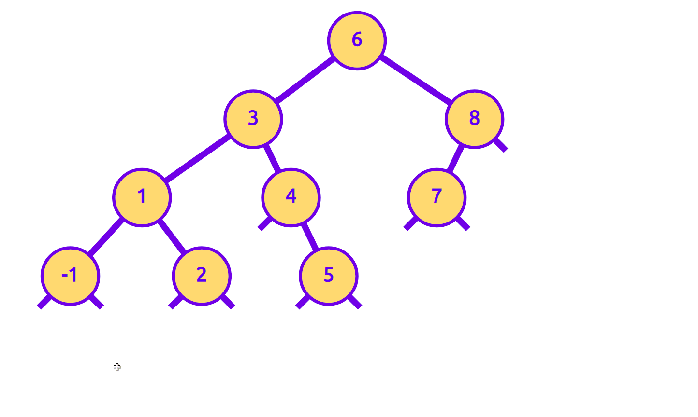

This is an interactive binary tree. Try it out [here](https://jasonxia17.github.io/data-structure-visuals/)!

This tool can be used to demonstrate all kinds of cool things, such as AVL rotations. Here's a right rotation caused by inserting a new node:

The tool also allows you to take a snapshot of a tree and come back to it later with a permalink. For example, [here](https://jasonxia17.github.io/data-structure-visuals/?data=%7B%220%22%3A%7B%22nodeData%22%3A%226%22%2C%22xCoord%22%3A601%2C%22yCoord%22%3A95%2C%22leftChildId%22%3A1%2C%22rightChildId%22%3A7%7D%2C%221%22%3A%7B%22nodeData%22%3A%223%22%2C%22xCoord%22%3A436%2C%22yCoord%22%3A220%2C%22leftChildId%22%3A2%2C%22rightChildId%22%3A5%7D%2C%222%22%3A%7B%22nodeData%22%3A%221%22%2C%22xCoord%22%3A259%2C%22yCoord%22%3A345%2C%22leftChildId%22%3A3%2C%22rightChildId%22%3A4%7D%2C%223%22%3A%7B%22nodeData%22%3A%22-1%22%2C%22xCoord%22%3A145%2C%22yCoord%22%3A470%2C%22leftChildId%22%3Anull%2C%22rightChildId%22%3Anull%7D%2C%224%22%3A%7B%22nodeData%22%3A%222%22%2C%22xCoord%22%3A354%2C%22yCoord%22%3A470%2C%22leftChildId%22%3Anull%2C%22rightChildId%22%3Anull%7D%2C%225%22%3A%7B%22nodeData%22%3A%224%22%2C%22xCoord%22%3A496%2C%22yCoord%22%3A345%2C%22leftChildId%22%3Anull%2C%22rightChildId%22%3A6%7D%2C%226%22%3A%7B%22nodeData%22%3A%225%22%2C%22xCoord%22%3A556%2C%22yCoord%22%3A470%2C%22leftChildId%22%3Anull%2C%22rightChildId%22%3Anull%7D%2C%227%22%3A%7B%22nodeData%22%3A%227%22%2C%22xCoord%22%3A788%2C%22yCoord%22%3A220%2C%22leftChildId%22%3A8%2C%22rightChildId%22%3Anull%7D%2C%228%22%3A%7B%22nodeData%22%3A%228%22%2C%22xCoord%22%3A728%2C%22yCoord%22%3A345%2C%22leftChildId%22%3Anull%2C%22rightChildId%22%3Anull%7D%7D) is the initial state of the tree shown in the GIF above.